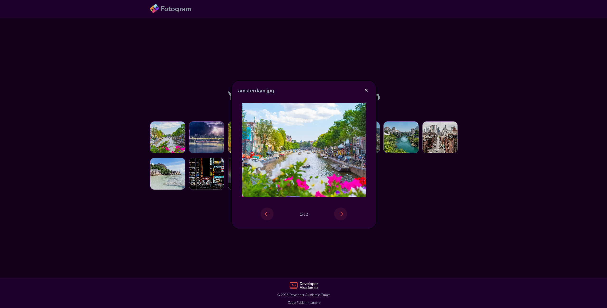

# Fotogram

A responsive photo gallery web app built with vanilla HTML, CSS, and JavaScript.

## Features
- Dynamic image rendering via JavaScript (no hardcoded HTML for images)
- Accessible full-screen dialog with keyboard navigation (Escape, Tab)
- Previous/next navigation with image counter
- WAI-ARIA labels for screen reader support
- Fully responsive layout (mobile, tablet, desktop)

## Screenshot

## Tech stack
- HTML5
- CSS3 (Flexbox, Grid, Media Queries)
- Vanilla JavaScript (DOM manipulation, no frameworks)

## Author
Fabian Klemenz